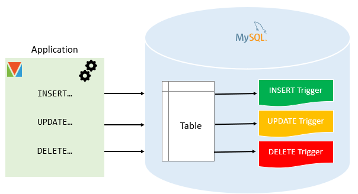

# 1. Creation of our database

Our database, named country_db, has 3 tables:
* Countries
* Cities
* Currencies

## 1.1. Relationships between tables


**NOTE**: If a table A contains a FK (PK of B), that means that we want a one-to-one relationship **FROM** A to B: a record in A is associated to one and only one record in B.

### 1.1.1. Countries and Cities

A county can have 1 city (min) or many cities (max).
A city can be associated with 1 country (min) and only 1 country (max).

Thus, between countries and cities tables, we have a one-to-many relationship (or cardinality) and city depends on country: cities table contains a FK referencing the countries table's id.

How to set this one-to-many cardinality? See below:

```
CREATE TABLE countries (
    country_id INT AUTO_INCREMENT PRIMARY KEY,
    field_1 ...,
    ...,
    field_n ...
);


CREATE TABLE cities (
    city_id INT AUTO_INCREMENT PRIMARY KEY,
    field_1 ...,
    ...,
    field_n ...,
    country_id INT,
    FOREIGN KEY country_id REFERENCES countries(country_id) -- one or many countries
);
```


### 1.1.2. Countries and Currencies

A country can be associated with 1 currency (min) and only 1 currency (max).
A currency can be associated with 1 country (min) or many countries (max).

Thus, between countries and currencies tables, we have a one-to-many relationship (or cardinality), country depends on currency: country take the FK referencing the currencies table's id.

```
CREATE TABLE countries (
    country_id INT AUTO_INCREMENT PRIMARY KEY,
    field_1 ...,
    ...,
    field_n ...,
    currency_id INT,
    FOREIGN KEY currency_id REFERENCES currencies(currency_id) -- one or many currencies
);


CREATE TABLE currencies (
    currency_id INT AUTO_INCREMENT PRIMARY KEY,
    field_1 ...,
    ...,
    field_n ...,
);
```

# 2. Improve our database

## 2.1. Searching operation optimization: indexes

There exist many types of indexes. Below are some of them:

### 2.1.1. Unique indexes

For example, a field of your table other than the PK that you want it to be unique. Example: email address.

**To add a UNIQUE INDEX**
```
CREATE UNIQUE INDEX unique_index
ON table_name(column_1,column_2,...);
```

OR

```
ALTER TABLE table_name
ADD CONSTRAINT unique_index UNIQUE KEY(column_1,column_2,...);
```

### 2.1.2. Prefix indexes

Efficient for string fields.

**To add a PREFIX INDEX**

```
CREATE INDEX prefix_index
ON table_name(column_name(length));
```

### 2.1.3. Composite indexes

Indexes composed of at list two columns (or fields).

**To add a COMPOSITE INDEX**

```
CREATE INDEX composite_index 
ON table_name(c2,c3,c4);
```


### 2.1.4. Clustered indexes

Indexes not seperated from the table. Typically, these are primary keys

---------

### 2.1.5. Delete an INDEX
```
ALTER TABLE table_name DROP INDEX composite_index;
```

## 2.2. Create triggers

"In MySQL, a trigger is a stored program invoked automatically in response to an event such as insert, update, or delete that occurs in the associated table."


Source: MySQL Tutorials
